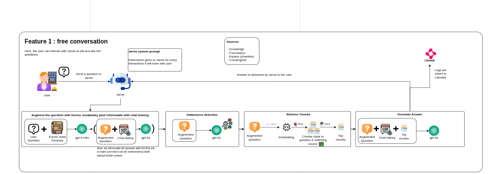
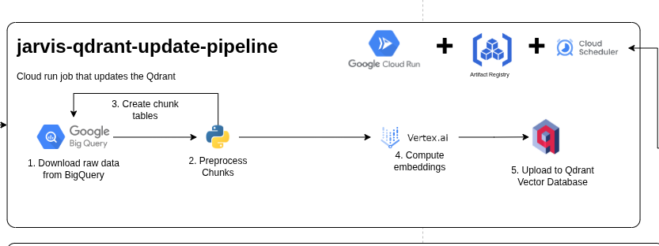

Le but de ce document est d'indiquer les informations importantes du talk ainsi que le plan que j'imagine suivre pour les slides

Le talk dure 10 mn + 5 mn de question. Il est autorisé de dépasser un peu le temps imparti, mais il faut veiller à ne pas trop empiéter sur le temps de questions.

j'aime les slides avec peu de texte qui me laissent expliquer le principe sans que les personnes passent leur temps à lire (mais j'aime bien les exemples avec du code pour avoir du concret avec highlight des parties dont je parle à chaque fois en faisant suivant )
J'aime également les petits schémas explicatifs de certains concepts.

## Titre
Faites parler vos données avec le RAG

## Description
Les modèles de langage répondent vite... mais pas toujours juste. Un RAG (Retrieval-Augmented Generation, ou « génération augmentée par la recherche ») consiste à faire répondre le modèle à partir de documents sélectionnés, plutôt que sur des connaissances générales. On cherche d’abord les passages pertinents dans une base de connaissance, puis on génère une réponse en s’appuyant sur ces extraits (idéalement cités).

Je vais vous partager un retour d’expérience sur un assistant interne développé pour une chaîne d’hôtels, dont l’objectif est de faciliter la recherche d’informations et la prise en main des procédures internes.

Dans ce talk, on parcourra le parcours complet d’une question, et pourquoi chaque étape compte pour la fiabilité :

* Reformulation de la demande (glossaire métier + historique)
* Routage vers la bonne famille de sources (ex. connaissances internes, conciergerie, chambres, fournisseurs, maintenance)
* Extraction de filtres de métadonnées depuis la demande (ex. établissement, service, catégorie) pour préfiltrer les documents/chunks récupérables
* Recherche vectorielle et sélection des passages transmis au modèle
* Suivi de la qualité des réponses (retours utilisateurs, dataset de test pour vérifier automatiquement la qualité du RAG, …)

# Plan

## Pourquoi les LLM changent la donne 

## Présentation
Loïc BOURG ITNetwork lead technique

## Le besoin 

chaine d'hôtels d'environ 10 hôtels en france souhaitant grossir
Besoin d'augmenter l'autonomie des nouveaux arrivants.
Une documentation de qualité mais pas suffisament utilisée à cause de la diversité des sources et de la mauvaise qualité de la recherche sur l'application

## L'état des lieux

Un data lake à disposition contenant toutes les données dont on a besoin
Des données de plutôt bonne qualité et pas trop longues
Un client disponible pour donner des exemples de questions avec les réponses souhaitées et les sources utilisées

## Le principe proposé

## Embeddings ?

Avant de faire l'histoire de la question, une petite explication sur le principe des embeddings et de la recherche vectorielle qui est le principe
le plus important à comprendre quand on fait du RAG.

embeddings passent un mot en vecteur à plusoeurs milliers de dimensions.

deux vecteurs proches veulent dire que les mots à l'origine de ce vecteur sont proche.

## Insertion des données dans la base de données vectorielle

La première étape est de trannsformer les sources de données provenant du datalake en "chunk", 
c'est à dire en un seul morceau de texte pour pouvoir faire l'embedding dessus (donc le transformer en un ensemble de vecteurs)

Il y a plusieurs stratégie différentes pour les longs document. Pour ce cas d'usage, chaque source de donnée était suffisament petite pour passer dans un seul chunk sans probléme.

## Base de donnée vectorielle ?

A quoi sert une base de donnée vectorielle ?
A trouver les vecteurs les plus proches entre eux.

Donc par exemple dans notre cas vectoriser les mots de la question et demander à la base vectorielle les "chunk" étant les plus proches.
Donc proche sémantiquement parlant 
 

## Augmentation de la question

Le principe est de se servir du glossaire de korner pour "augmenter" la question afin de pouvoir clarifier le sens de certains acronymes utilisés en interne

par exemple

Quand est ce que je dois sortir les poubelles à HKO

devient

Quand est ce que je dois sortir les poubelles à HKO(HOTEL KORNER MOTMARTRE)

Pour ca on donne le glossaire + la question et on lui demande de reformuler

TODO: exemple en python avec langchain, s'inspirer de samples/augment_question_with_glossary.py en faisant en sorte que ce soit plus concis et propre afin que ce soit agréable à suivre en utilisant les fonctionalités de slidev

## Détection des sources de données à utiliser

Afin d'éviter d'interroger toutes les sources de données, la première étape est de 

pourquoi faire ca ? Certaines source de données ont beaucoup plus de données que d'autre. 

Il peut donc étre compliqué de trouver les bons chunk pour les sources de données ayant peu de chunk.

Comment on fait ?

TODO: exemple en python avec langchain, s'inspirer de samples/find_relevant_sources en faisant en sorte que ce soit plus concis et propre afin que ce soit agréable à suivre en utilisant les fonctionalités de slidev

## Recherche vectorielle

on embed la question et on demande les chunks les plus proches de la question

on combine ensuite les chunks avec la question augmentée et le prompt systéme et on lui demande de répondre

TODO: exemple en python avec langchain, s'inspirer de samples/get_answer_from_questions_and_chunks.py en faisant en sorte que ce soit plus concis et propre afin que ce soit agréable à suivre en utilisant les fonctionalités de slidev

## Et aprés ?
Note: je pense que j'ai déja largement assez de contenu pour les dix minutes (je fais souvent trop de slide et à la fin j'en enléve car c'est trop long)
je pense donc faire les prochaines slide pour passer rapidement sur ce qu'il faut faire ensuite et les pistes d'amélioration sans détailler plus 

- Tester la qualité des réponses avec les questions d'exemple
- Modifier les différents paramètres en fonction du succés des réponses

Si on ne trouve pas le ou les bon chunk pour répondre
- Ajouter du BM25 en plus du vectoriel (recherche full texte)
- Vérifier le contenu des chunk vectorisés
- Essayer d'augmenter le nombre de chunk utilisé 
- Ajouter un reranker
- Ajouter du filtrage plus intelligent en entrée (ne pas se baser uniquement sur la source mais essayer de voir si l'utilisateur parle d'un hôtel spécifique, )
- Réduire la quantité de chunk and base (source de données pas utile ? ou pas entièrement utile ?)
- Changer le modéle d'embedding
- Passer au agentic RAG ?

Si le ou les bon chunk sont trouvés mais la réponse n'est pas bonne:
- Modifier le prompt systéme ou le prompt de réponse pour clarifier
- Diminuer le nombre de chunk pour éviter les confusions
- 

Quelque chose qui marche pas mal => Recréer la même converstation et demander au llm pourquoi il n'a pas bien répondu à la question.

## Questions ?

TODO:
- [x] graph mermaid moins moches
- [x] liste à puce dans les default centré mieux affichée
- [x] v clicks manquant sur certaines slide (notament conclusion)
- [x] numéro de page
- [x] modifier question opéra => hotel opéra
- [x] changer température ?
- [x] beaucoup faute
- [x] Première slide moins moche
- [x] Présentation avec logo ITN
- [x] Slide conclusion à retravailler
- [x] Vérifier si je peux avoir le cout moyen d'une question (openAI: ~ 1.5 centimes par question, cohere: 0.2 centimes par question) 
- [x] réduire "si ca répond mal"

Premier test à vide: 8mn20secondes
test devant l'équipe: 15mn50secondes