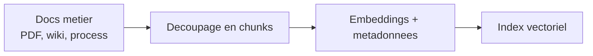
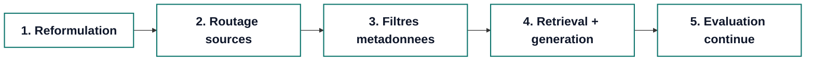
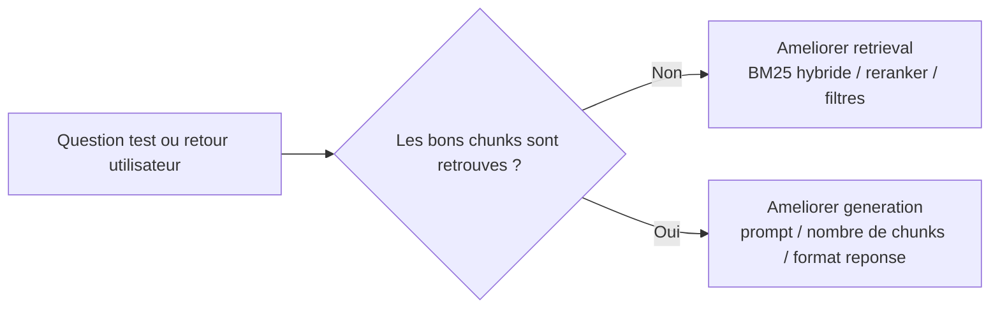

# Faites parler vos donnees avec le RAG

### Comment rendre un assistant interne plus fiable

<div class="mt-10 text-sm opacity-80">
Loic BOURG · Lead Technique IT Network
</div>

<div class="mt-8 text-lg">
Les LLM repondent vite. <strong>Le RAG les aide a repondre juste.</strong>
</div>

<!--
0:00 - 0:45
Promesse du talk + cadre 10 min
-->

---
layout: center
---

# Le probleme metier

<div class="mt-8 grid grid-cols-3 gap-6 text-left">
  <div class="rounded-lg border border-teal-200 bg-teal-50/50 p-4">
    <div class="text-2xl font-bold">10+</div>
    <div class="mt-2 text-sm">hotels a operer</div>
  </div>
  <div class="rounded-lg border border-teal-200 bg-teal-50/50 p-4">
    <div class="text-2xl font-bold">Docs utiles</div>
    <div class="mt-2 text-sm">mais dispersees dans plusieurs sources</div>
  </div>
  <div class="rounded-lg border border-teal-200 bg-teal-50/50 p-4">
    <div class="text-2xl font-bold">Objectif</div>
    <div class="mt-2 text-sm">accelerer l'autonomie des nouveaux arrivants</div>
  </div>
</div>

<div class="mt-8 text-lg">
Probleme initial: <strong>la recherche classique ne retrouvait pas vite la bonne procedure.</strong>
</div>

<!--
0:45 - 1:45
Contexte concret, pas de jargon
-->

---
layout: two-cols
layoutClass: gap-10
---

# D'ou vient la connaissance ?

<div class="text-lg leading-8">
Avant de repondre, on doit d'abord <strong>preparer la base de connaissance</strong>.
</div>



<div class="mt-5 text-sm opacity-80">
Ce travail est fait en amont et rejoue a chaque mise a jour documentaire.
</div>

::right::

<div class="rounded-xl border border-slate-200 bg-white/80 p-5 shadow-sm">
  <div class="font-semibold">Pourquoi c'est important ?</div>
  <ul class="mt-4 leading-8">
    <li>Les reponses viennent de sources internes</li>
    <li>Le moteur retrouve des passages, pas tout un document</li>
    <li>Les metadonnees permettent des filtres metier</li>
  </ul>
</div>

<div class="mt-6 rounded-xl border border-amber-200 bg-amber-50/75 p-4 text-sm">
Sans cette indexation, pas de retrieval fiable.
</div>

<!--
1:45 - 2:30
Expliquer d'ou vient la connaissance avant la requete live
-->

---
layout: two-cols
layoutClass: gap-10
---

# Parenthese: c'est quoi un embedding ?

<div class="text-lg leading-8">
Un embedding convertit un texte en <strong>vecteur de nombres</strong> qui capture son sens.
</div>

<div class="mt-6 rounded-xl border border-teal-200 bg-teal-50/70 p-4">
  <div class="text-sm opacity-70">Exemple de transformation</div>
  <div class="mt-2 font-mono text-sm">
    "sortir les poubelles a HKO" -> [0.12, -0.44, 0.87, ...]
  </div>
</div>

<div class="mt-6 text-lg">
La recherche semantique compare ces vecteurs (similarite cosine), pas seulement des mots exacts.
</div>

::right::

<div class="rounded-xl border border-slate-200 bg-white/80 p-5 shadow-sm">
  <div class="font-semibold text-lg">Question utilisateur</div>
  <div class="mt-2">"Quand sortir les poubelles a HKO ?"</div>

  <div class="mt-5 text-sm uppercase tracking-wider opacity-70">Scores de similarite</div>
  <div class="mt-3 space-y-2">
    <div class="flex items-center justify-between rounded-lg bg-emerald-50 px-3 py-2">
      <span>Procedure fermeture HKO</span>
      <span class="font-semibold text-emerald-700">0.91</span>
    </div>
    <div class="flex items-center justify-between rounded-lg bg-sky-50 px-3 py-2">
      <span>Checklist fin de shift</span>
      <span class="font-semibold text-sky-700">0.78</span>
    </div>
    <div class="flex items-center justify-between rounded-lg bg-slate-100 px-3 py-2">
      <span>Planning petit-dej</span>
      <span class="font-semibold text-slate-600">0.22</span>
    </div>
  </div>
</div>

<div class="mt-5 text-sm opacity-80">
On retient les chunks les plus proches en sens.
</div>

<!--
2:30 - 3:15
Poser la notion d'embedding avant d'attaquer le fil rouge
-->

---

# Le pipeline en 5 etapes



<div class="mt-4 text-sm opacity-80">
Fil rouge du talk: "Quand est-ce que je dois sortir les poubelles a HKO ?"
</div>

<!--
3:15 - 3:45
Donner la carte mentale pour la suite
-->

---
layout: two-cols
layoutClass: gap-10
---

# 1) Reformulation

<div class="text-sm opacity-80 mb-2">Avant</div>

```text
Quand est-ce que je dois sortir les poubelles a HKO ?
```

<div class="text-sm opacity-80 mt-5 mb-2">Apres (question augmentee)</div>

```text
Quand est-ce que je dois sortir les poubelles a
HKO (Hotel Korner Montmartre) ?
```

::right::

<div class="mt-8">
  <div class="badge">Glossaire metier</div>
  <div class="badge">Acronymes internes</div>
  <div class="badge">Historique conversation</div>
</div>

<div class="mt-8 text-lg leading-7">
On clarifie la demande <strong>avant</strong> de chercher des documents.
</div>

<!--
3:45 - 4:30
Montrer que la precision commence ici
-->

---

# 2) Routage des sources

<div class="mt-5 text-lg">Ne pas chercher partout. Chercher au bon endroit.</div>

<div class="mt-8">
  <div class="flex flex-wrap gap-3">
    <div class="badge">Conciergerie</div>
    <div class="badge">Chambres</div>
    <div class="badge">Maintenance</div>
    <div class="badge">Fournisseurs</div>
    <div class="badge">Connaissances internes</div>
  </div>
</div>

<div class="mt-8 grid grid-cols-2 gap-6">
  <div class="rounded-lg border border-amber-200 bg-amber-50 p-4">
    <div class="font-semibold">Sans routage</div>
    <div class="mt-2 text-sm">Trop de bruit, moins de precision</div>
  </div>
  <div class="rounded-lg border border-emerald-200 bg-emerald-50 p-4">
    <div class="font-semibold">Avec routage</div>
    <div class="mt-2 text-sm">Moins de candidats, retrieval plus pertinent</div>
  </div>
</div>

<!--
4:30 - 5:15
Faire comprendre la reduction du bruit
-->

---

# 3) Filtres metadonnees

<div class="mt-6 text-lg">
On extrait des indices de la question pour prefiltrer les chunks.
</div>

<div class="mt-7 grid grid-cols-3 gap-5">
  <div class="rounded-lg border border-slate-200 p-4">
    <div class="text-sm opacity-70">hotel</div>
    <div class="mt-2 font-semibold">HKO</div>
  </div>
  <div class="rounded-lg border border-slate-200 p-4">
    <div class="text-sm opacity-70">service</div>
    <div class="mt-2 font-semibold">Housekeeping</div>
  </div>
  <div class="rounded-lg border border-slate-200 p-4">
    <div class="text-sm opacity-70">categorie</div>
    <div class="mt-2 font-semibold">Procedure de fermeture</div>
  </div>
</div>

<div class="mt-8 text-lg">
Effet: <strong>meilleure precision sans augmenter le cout du modele.</strong>
</div>

<!--
5:15 - 6:00
Levier concret et facile a expliquer
-->

---
# 4) Retrieval + generation

```py {all|2-3|5-6|8-12|all}
question = user_question
q_aug = reformulate_with_glossary(question, glossary, history)

source_families = route_sources(q_aug)
filters = extract_metadata_filters(q_aug)

chunks = vector_search(
    query=q_aug,
    source_families=source_families,
    filters=filters,
    k=6,
)
answer = generate_answer(q_aug, chunks, system_prompt)
```

<div class="mt-4 text-sm">
Reponse attendue: action claire + citation de source.
</div>

<div class="mt-2 rounded-lg border border-teal-200 bg-teal-50 p-3 text-sm">
"A HKO, les poubelles sont sorties a 21h30 apres la ronde du soir."
<br>
Source: Procedure_HKO_Fermeture_v3.pdf#p2
</div>

<!--
6:00 - 6:45
Unique snippet code du talk
-->

---
layout: two-cols
layoutClass: gap-10
---

# 5) Evaluation continue

<div class="mt-2 text-lg">Ce qui fait progresser le systeme: mesurer, puis corriger.</div>



::right::

<div class="mt-8 rounded-xl border border-slate-200 bg-white/75 p-5 shadow-sm">
  <div class="text-xs uppercase tracking-widest opacity-70">Boucle d'amelioration</div>
  <ul class="mt-3 leading-8">
    <li>Mesurer sur un dataset de test</li>
    <li>Analyser les retours utilisateurs</li>
    <li>Ajuster retrieval et generation separement</li>
  </ul>
</div>

<div class="mt-4 text-sm opacity-80">
Dataset de test + feedback terrain = boucle d'amelioration fiable.
</div>

<!--
6:45 - 8:00
Slide de debug tres pragmatique
-->

---
layout: two-cols
layoutClass: gap-10
---

# Resultats et limites

## Ce qui a marche

- Acces plus rapide aux procedures internes
- Assistant plus utile pour l'onboarding
- Reponses mieux justifiees grace aux citations

::right::

## Ce qui reste difficile

- Qualite et fraicheur des sources
- Cas metier ambigus ou mal formules
- Necessite d'une maintenance continue

<div class="mt-8 rounded-lg border border-slate-200 p-3 text-sm">
Message honnete: le RAG reduit fortement les erreurs, mais ne supprime pas le besoin de pilotage.
</div>

<!--
8:00 - 9:00
Credibilite: benefices + limites
-->

---
layout: center
class: text-center
---

# Merci

## La fiabilite d'un RAG vient du pipeline, pas d'une seule brique.

<div class="mt-8 text-lg">Questions ?</div>

<div class="mt-10 text-sm opacity-70">
Si utile, je peux partager la grille de debug utilisee en production.
</div>

<!--
9:00 - 10:00
Clore net et ouvrir la Q&A
-->
