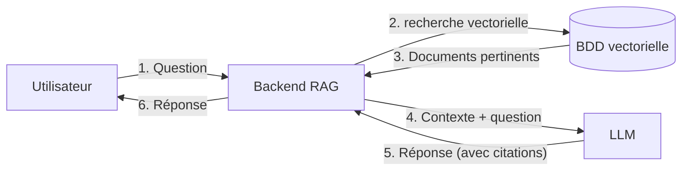

# Faites parler vos données avec le RAG

---
layout: center
---

# Loïc BOURG

Lead technique @ITNetwork

---
layout: center
---

# RAG ?

**R**etrieval **A**ugmented **G**eneration

<v-clicks>

- Ancrer les réponses sur des faits réels
- Actualiser les connaissances en temps réel
- Citer les sources utilisées

</v-clicks>


---
layout: cover
---




---
layout: center
---

# Le contexte du projet

<v-clicks>

- Chaine d'hôtels d'environ 10 hôtels en france souhaitant grossir
- Besoin d'augmenter l'autonomie des nouveaux arrivants.
- Beucoup de documentation mais dans différentes applications

</v-clicks>

---
layout: default
---

# Recherche vectorielle
Quand est-ce que je dois sortir les poubelles à opéra ?

---
layout: center
---

# Indexation des documents dans la base vectorielle

<v-clicks>

- Découpage des longs documents en petits morceaux ("chunk")
- Ajout de metadata à l'intérieur des chunk
- Embedding des chunk
- Insertion

</v-clicks>

---
layout: center
---

# Embedding ?

<v-clicks>

- Transformation de texte en un vecteur représentant son contenu sémantique
- Des textes proches en sens ont des vecteurs proches

</v-clicks>

---
layout: default
---

```python {1-7|1-3,9-10|1-3,12-18}
A = "procédure de check-in"
B = "enregistrement à la réception"
C = "recette de pancakes"

vec_A = compute_embedding(A)
vec_B = compute_embedding(B)
vec_C = compute_embedding(C)

sim_AB = cosine_similarity(vec_A, vec_B)
sim_AC = cosine_similarity(vec_A, vec_C)

print("sim(A, B) =", sim_AB)  # -> 0.999 
print("sim(A, C) =", sim_AC)  # -> 0.293 

```

---
lineNumbers: true
layout: default
---

# Recherche vectorielle
Quand est-ce que je dois sortir les poubelles à opéra ?

<div class="flex items-center justify-center h-60 text-center">

- Embedding de la question
- Recherche des "chunk" les plus proches au niveau sémantique de la question

</div>

---
layout: default
---

```python
query_vector = compute_embedding(question)

top_k = 5
matches = vector_db.search(vector=query_vector, top_k=top_k)

chunks = [m.payload["text"] for m in matches]
```


---
layout: default
---


```md
---
titre: "Opéra: les informations de base"
auteur: "Service Exploitation"
lien: "https://www.doc-interne.com/korner-opera/informations-generales"
---

…

## Horaires de passage des poubelles
Poubelle verte/grise : Tous les jours à 16h devant l'hôtel.
Poubelle jaune : Lundi, mercredi et vendredi à 16h devant l'hôtel.
Conteneur à verre : Derrière le bâtiment en face de l'hôtel.

…
````


---
layout: default
---

# Génération de la réponse
Quand est-ce que je dois sortir les poubelles à opéra ?


<div class="flex items-center justify-center h-60 text-center">


- On envoi le prompt systéme et les chunk au llm
- On renvoi la réponse à l'utilisateur


</div>

---
layout: default
---


```python {1-7|10-13|15}
SYSTEM_PROMPT = """
Tu es un assistant RAG.
Règles :
- Réponds uniquement à partir des CHUNKS fournis. N’invente rien.
- Si l’info n’est pas dans les CHUNKS, dis "Je ne sais pas".
- À la fin, ajoute une section "Sources" avec des liens Markdown.
  Format attendu : - [Titre du chunk](source_url) (ou [Chunk <id>](source_url) si pas de titre)
"""

messages = [
    {"role": "system", "content": SYSTEM_PROMPT},
    {"role": "user", "content": f"Question: {question}\n\nCHUNKS:\n{context}"},
]

response = LLM.generate(messages=messages, temperature=0.0)
```


---
layout: default
---

```markdown
Les poubelles à l'Hôtel Korner Opéra doivent être sorties selon le calendrier suivant :

Poubelle verte/grise : Tous les jours à 16h devant l'hôtel.
Poubelle jaune : Lundi, mercredi et vendredi à 16h devant l'hôtel.
Conteneur à verre : Derrière le bâtiment en face de l'hôtel.

## Sources
- [Opéra: les informations de base](https://www.doc-interne.com/korner-opera/informations-generales)

```

---
layout: two-cols-header
---

# Et si ca répond mal ?

::left::

<v-click>

## Si le bon chunk n'est pas retourné

</v-click>
<v-clicks>

- Jouer sur le nombre de chunk récupéré
- Augmenter la question avec un glossaire pour le jargon interne
- Passer en recherche hybride (vectoriel + textuel)
- Ajouter un reranker
- Ajouter du filtrage par metadata
- Réduire la quantité de chunk
- Passer en mode "Agentic"


</v-clicks>

::right::

<v-click>

## Si la réponse n'est pas bonne

</v-click>

<v-clicks>

- Réduire le nombre de chunk
- Changer de modèle
- Modifier le prompt système

</v-clicks>


<style>
.two-cols-header {
  column-gap: 20px; /* Adjust the gap size as needed */
}
</style>

---
layout: center
---

# Conclusion

- Systéme en production depuis 1.5 ans utilisé quotidiennement
- Amélioration notable de la facilité à aller chercher des informations
- Beaucoup de temps passé à toucher aux différents paramétres

---
layout: center
---

# Questions ?